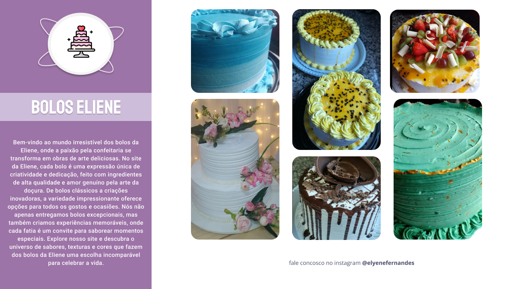

<h1 align="center"> Bolos Eliene</h1>

  <a href="#-technologies">Technologies</a>&nbsp;&nbsp;&nbsp;|&nbsp;&nbsp;&nbsp;
  <a href="#-project">Project</a>&nbsp;&nbsp;&nbsp;|&nbsp;&nbsp;&nbsp;
  <a href="#-layout">Layout</a>&nbsp;&nbsp;&nbsp;|&nbsp;&nbsp;&nbsp;
  <a href="#memo-license">License</a>

  

 
  

   
  
 

## 🚀 Technologies

This project was developed with the following technologies:

- HTML 
- CSS
- Git e Github
- Figma

## 💻 Project

  Bem-vindo ao mundo irresistível dos bolos da Eliene, onde a paixão pela confeitaria se transforma em obras de arte deliciosas. No site da Eliene, cada bolo é uma expressão única de criatividade e dedicação, feito com ingredientes de alta qualidade e amor genuíno pela arte da doçura. 

  <ul>
  <li>Display Grid</li>
  <li>Flexible Unit of Measure</li>
  <li>Variables</li>
  <li>Animations</li>
  <li>Transitions and Transformations</li>
  <li>Media Queries</li>
  <li>Fitting the Image and Overlapping the Text</li>
  <li>Adjusting texts with css clamp</li>

  </ul>

 

## 🔖 Layout

You can view the layout of the project through [FROM THIS LINK](https://www.figma.com/file/gszpuGAWVUwLdAhCLZi1WK/bolos-eliene?type=design&node-id=0%3A1&mode=design&t=Jbm1rDlGpnrNqCzy-1). Must have an account on the [Figma](https://figma.com) to access it. 

  

## :memo: License

This project is licensed under the MIT license.

---

Made with ♥ by Iara Marques :wave: [Join the RocketSeat community!](https://discord.gg/rocketseat)